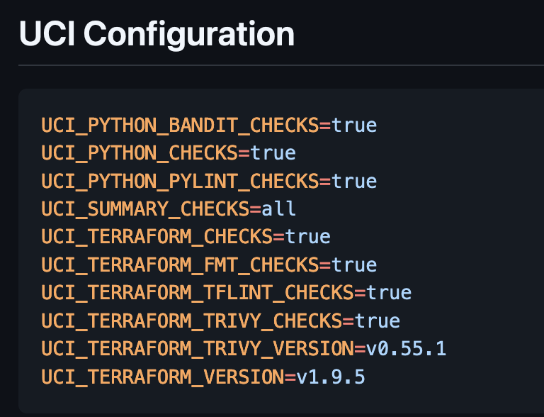
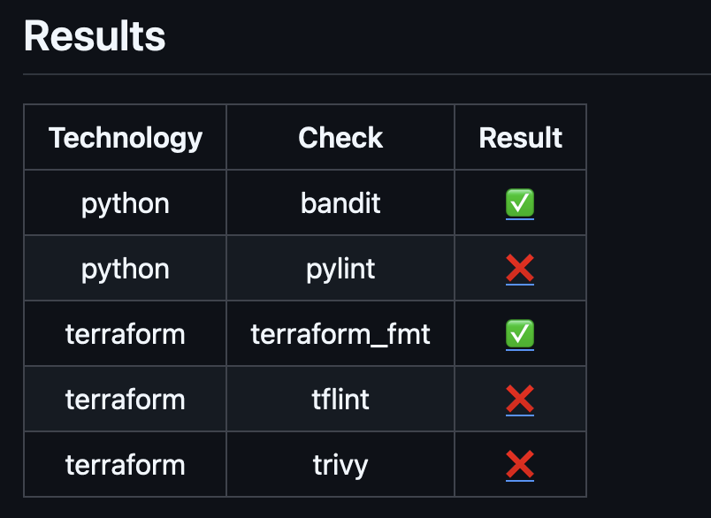
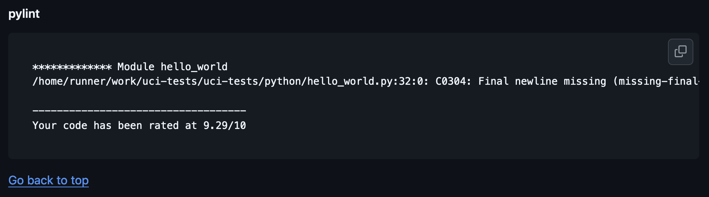

<!-- TOC start (generated with https://github.com/derlin/bitdowntoc) -->

- [UCI](#uci)
   * [Usage](#usage)
      + [Checking the results](#checking-the-results)
   * [Contributing & Testing](#contributing--testing)
   * [Customization](#customization)
      + [Checks](#checks)
      + [Configuration](#configuration)

<!-- TOC end -->

# UCI

Universal CI GitHub Action to add in your workflows.

## Usage

You can set it up to run on creating or updating
pull requests like this complete workflow:

```yaml
name: Your workflow name

on: pull_request

jobs:
  lint:
    runs-on: ubuntu-latest

    steps:
      - name: Checkout the source code
        uses: actions/checkout@v4

      - name: Run UCI checks
        uses: meltingcore/uci@v2
```

You can invoke the action:

- with a specific version (like `v1.1.0`) to hardcode to specific release
- with a major version (like `v1`) to always run the latest release 
**of that major version** (i.e. `v1.1.0`, `v1.1.2`, `v2.0.0`, etc.)

### Checking the results

The action generates a summary of the checks that were run and
displays it at the end of the workflow. In the summary you can check:

_The complete UCI configuration_


_Table with the checks' results_


_Logs for each check_


If any check fails the whole action step will fail to make
sure that the PR is not merged with failing checks.

## Contributing & Testing

Every PR should be first raised as **draft** one. When that 
PR is then created or updated (but not merged) it triggers
a workflow that creates a tag named after the development branch
that is attempted to be merged to the `main` branch but with 
`version-` as prefix. So if you want to validate any changes before
your PR is ready for review, and your development branch name
is `bugfix/something`, you can just invoke the uci action with 
your branch name as follows:

```yaml
      - name: Run UCI checks
        uses: meltingcore/uci@version-bugfix/something
```

After you are satisfied that your changes work as intended you can
then remove the draft status from your PR and merge it upon approval.

Repository used for testing the solution so far is:
[meltingcore/uci-tests](https://github.com/meltingcore/uci-tests)

## Customization

### Checks

Currently, contains the following checks:

* **Python**
  * pylint
  * bandit
* **Terraform**
  * terraform fmt
  * tflint
  * trivy

### Configuration

The UCI uses a dotenv configuration file named `uci.env` that
can be used for customizing the behaviour of the action.

The configuration options are as follows (the values in bold are defaults):

- `UCI_SUMMARY_CHECKS`: [all | **failed**] - the summary of the checks
  that should be displayed in the end. If set to `all` it will
  display all the checks that were run. If set to `failed` it will
  display only the failed checks.
- `UCI_PYTHON_CHECKS`: [**true** | false] - whether to run Python checks at all
- `UCI_PYTHON_PYLINT_CHECKS`: [**true** | false] - whether to run pylint checks
- `UCI_PYTHON_BANDIT_CHECKS`: [**true** | false] - whether to run bandit checks
- `UCI_TERRAFORM_CHECKS`: [**true** | false] - whether to run Terraform checks at all
- `UCI_TERRAFORM_VERSION`: [**v1.9.5** | <string>] - the version of Terraform to use.
Should be any valid version string that Terraform supports (with the v prefix).
- `UCI_TERRAFORM_FMT_CHECKS`: [**true** | false] - whether to run terraform fmt checks
- `UCI_TERRAFORM_TFLINT_CHECKS`: [**true** | false] - whether to run tflint checks
- `UCI_TERRAFORM_TRIVY_CHECKS`: [**true** | false] - whether to run trivy checks
- `UCI_TERRAFORM_TRIVY_VERSION`: [**v0.55.1** | <string>] - the version of Trivy to use.
Should be any valid version string that Trivy supports (with the v prefix).

If you want to override any of them you can place `uci.env` file in 
the root of your repository and set the values you want to override.

Example:

- Turn off python checks
- Use older terraform version
- Show results of all checks

```env
UCI_SUMMARY_CHECKS=all
UCI_PYTHON_CHECKS=false
UCI_TERRAFORM_VERSION=v1.5.0
```
